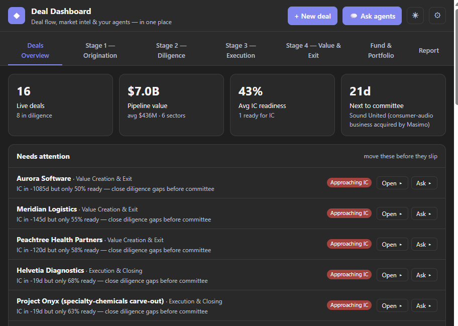
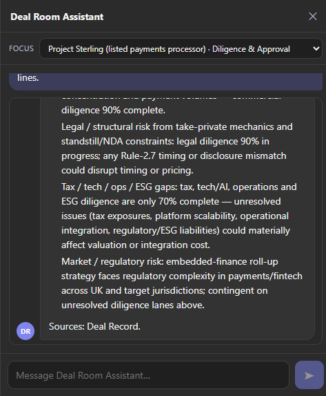
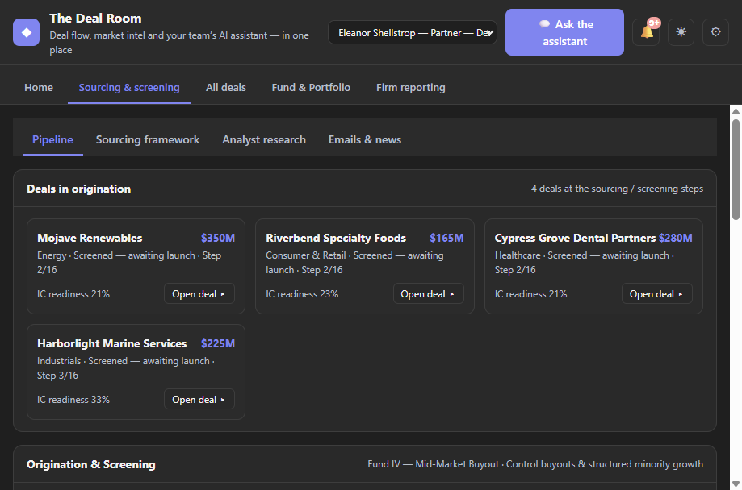
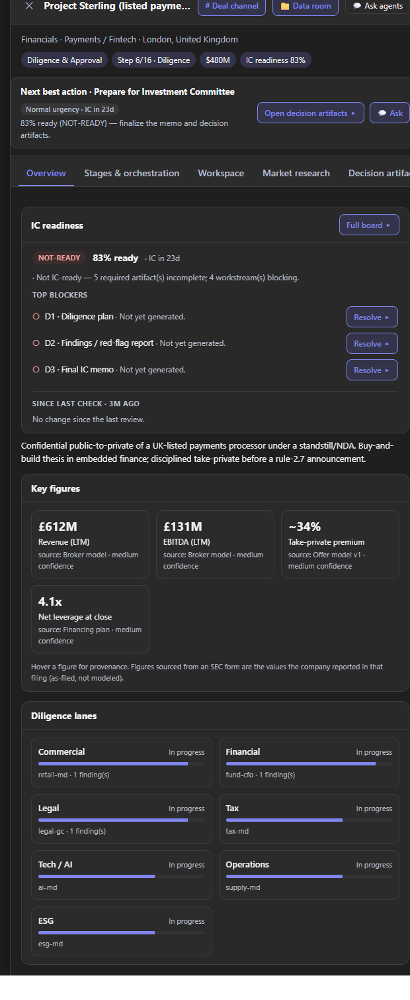
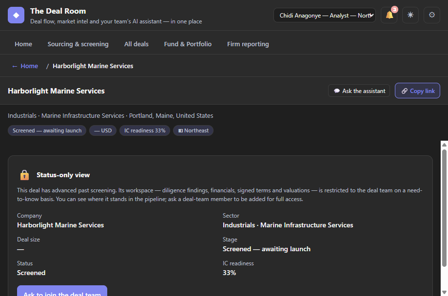

# The Deal Room

> **The AI deal team that lives in Microsoft Teams.**

Private-equity deal flow runs on scattered spreadsheets, inboxes and data rooms — and the
answers live in people's heads. **The Deal Room** puts the whole journey — **source → screen
→ diligence → IC → own → exit** — inside the Microsoft Teams channel your fund already works
in, with an **AI deal team you talk to in plain language**. Every answer is grounded in the
live deal record, delivered by the right specialist, and scoped to who's asking.

No new portal to adopt. No paid data feeds to demo. **One command** to stand it up in your own
tenant.



<sub>*The same console runs **natively in Microsoft Teams** and as a **standalone web app**, over one shared deal record.*</sub>

---

### 📖 Contents

**On this page:** [Why it matters](#why-it-matters) · [What you can do](#what-you-can-do) · [Features](#the-major-features) · [See it in action](#see-it-in-action)

**Deep dives — the "how", for builders:**

| [📐 Architecture](docs/ARCHITECTURE.md) | [🧭 How it works](docs/HOW-IT-WORKS.md) | [🗂️ Inside a deal](docs/DEAL-STAGES.md) | [🔐 Access model](docs/ACCESS-MODEL.md) | [☁️ Deploy](docs/DEPLOY.md) |
|:--:|:--:|:--:|:--:|:--:|
| the system on one page | internals & repo layout | stages, workspace & data room | RBAC, need-to-know & demo | one command to your tenant |

<sub>**[📚 All documentation →](docs/README.md)** · [ Demo walkthrough](docs/demos/DEMO-WALKTHROUGH.md) · [📋 Demo runbook](docs/demos/DEMO-RUNBOOK.md) · [🛡️ Security](SECURITY.md) · [🔒 Security & compliance (buyer appendix)](docs/security/buyer-security-compliance.md) · [🤝 Contributing](CONTRIBUTING.md)</sub>

---

## Why it matters

| | |
|---|---|
| 🗣️ **Zero context-switching** | Q&A, diligence and approvals happen in the channel the team already lives in — adoption doesn't hinge on opening a separate app. |
| 🎯 **The right answer for the right person** | Specialists, deal data and write actions are scoped to the requester's role, with true **deal-by-deal need-to-know** and hide-able **confidential deals**. |
| 🧾 **One source of truth** | The bot, the dashboard and M365 Copilot all read the *same* live record — no stale copies, no "which version?". |
| ⚡ **Demo-ready in minutes** | Real, **keyless** market data and **one-command** deploy — no paid data providers, and no Cosmos DB required to run. |

## What you can do

- **Ask your deals questions** in plain language and get grounded, cited answers.
- **Let the assistant propose the next step** — log a blocker, resolve an issue — and **apply it with one click**; every applied change lands on the deal's **audit trail** under your name.
- **Source & screen** targets with an AI funnel and live SEC / analyst workups.
- **Run diligence** across specialist lanes into an IC-ready pack, tracked on a **red/amber/green workbench**.
- **Decide** on returns (IRR/MOIC), value-creation, risk and IOI/LOI — exportable to Excel — with an **IC readiness board** (verdict + top blockers + *what changed since last check*).
- **Compare deals side-by-side** on the same decision fields and copy the grid out.
- **Own & exit** — monitor MOIC/IRR, run the 100-day plan, work the **watchlist**, and prep the exit.
- **Get board-ready documents drafted for you** — every deal's data room arrives **pre-populated** with a full IC pack (memo, deck, deal & returns models) drafted from the live record and **branded to your firm's house style**; export **LP reports with a full source-and-methodology lineage**, then **certify** a report LP-ready as an immutable, dated snapshot.
- **Keep it confidential** — hide sensitive deals and grant access person-by-person.

## Finding your way around

Five tabs across the top. That is the whole product.

| Tab | In one sentence |
|---|---|
| **Home** | What needs you today — the daily briefing, the four headline figures, and the queue. |
| **Sourcing & screening** | Companies you are looking at but have not committed to: pipeline, the sourcing framework, analyst research, and live filings and news. |
| **All deals** | The deals you are actually running. Press a row to open one. |
| **Fund & Portfolio** | The fund's money, and the companies it already owns. |
| **Firm reporting** | The certified numbers you would send to an investor. |

Open a deal and you get five pages, in the same order on every deal: **Brief · The case ·
The work · Analysis · Papers**.

Two rules the interface holds itself to: every figure says what it is counting and
what it excludes, and where a number is not in the figures above it, the screen names
what is missing rather than leaving you to work it out. If the product cannot show you
something, it says so rather than leaving a gap.

For a click-by-click tour written for someone who has never seen it, read the
[demo walkthrough](docs/demos/DEMO-WALKTHROUGH.md).

---

## The major features

### 💬 An AI deal team you @mention

Ask any deal a question the way you'd ask a colleague. **`@Deal Room Assistant`** answers in
**plain language from that specific deal's live record** — mentioned right in the deal's channel,
it already works out *which* deal you mean, so you never restate the company or deal name, and it
answers from the right **specialist's** viewpoint (analyst, sector MDs, partner, …).

> 💬 *what's the investment thesis here, in three lines?*
> 💬 *summarise the latest diligence findings and open risks.*
> 💬 *how does the retail MD read this opportunity?*



### 📊 A dashboard native to your channel

The full deal workspace lives **right where the team already works — natively inside Teams** — no
separate portal and no second sign-in, and the *same* build also runs as a standalone web console.
Fund KPIs, the live origination funnel, per-deal detail, an inline assistant, and proactive
**alerts** turn the channel into the deal's activity feed.

### 🗂️ The whole lifecycle — source to exit

The app *is* the process: five workspaces carry a deal from first signal to realisation, gated
at every hand-off — **Origination → Diligence → Execution → Value & Exit**, plus a **Fund &
Portfolio** roll-up. Each stage names the accountable persona and produces the artifacts the IC
actually decides on.



> 🔎 **[Inside a deal — a tab-by-tab tour of every stage & workspace →](docs/DEAL-STAGES.md)**

### 📁 Every deal gets its own data room — arriving ready to work

The moment you commit to pursue a deal, it gets its own private home for the team — a **Teams
channel** to work in and a **secure data room** for its documents — set up automatically, and it
**arrives pre-populated**. A complete, board-ready **IC pack** — memo, deck, and deal & returns
models — plus a plain-English **data-room guide** are drafted from the live record and dropped
straight into the room, so the team opens to a finished first draft, never a blank page. Generate
or refresh any document from the **Documents** tab — **download** a personal copy on your own M365
licence, or **publish** into the shared data room (write-gated to the deal team, authored *as you*).

### 📝 Documents that look like *your* firm's — not a template's

The generated IC memo, deck and models are **institutional-grade** — thesis, merits, risks,
valuation & returns, value creation, diligence findings and the IC ask, all built from the live
record so a partner starts from a real draft that needs only a light polish. And they carry **your
house style**: set your fund name, brand colours, confidentiality wording and which sections appear
once in **Settings → Document templates**, and every future document follows suit — adopt the
product without re-templating a thing.

### 📑 Decision-grade artifacts & IC readiness

Every deal carries the artifacts a PE IC decides on — **LBO / returns** (IRR/MOIC + sensitivity
grid), a **value-creation / 100-day plan** (EBITDA bridge), a **risk register**, and **IOI/LOI**
— each derived from the live record and exportable to Excel, with an **IC-readiness** board that
calls a **READY / CONDITIONAL / NOT-READY** verdict.

### 🧭 A Deal brief built for the deal team

Each deal leads with the decision, not a status bar: the **IC-readiness verdict** with the
**top blockers** (one-click **Resolve**), a **“what changed since last check”** delta (readiness
and verdict moves, newly-blocking vs resolved items), a deterministic **next best action**, a
**red/amber/green diligence workbench** across the workstreams, and **side-by-side comparison** of 2–4 deals.
The whole surface is **decision-data-first** — market intelligence is supporting context, not the
lead — and there's **one invisible assistant**, no exposed “bots.”



### ✅ Propose → approve → apply, with a full audit trail

The assistant doesn't just answer — inside a deal it **proposes concrete next steps** grounded in
the deal's own state (*log this blocking workstream as an issue*, *mark this issue resolved*). It
**never acts on its own**: you **Apply** a suggestion, and the change is written to the live
record **and** to a **fully-attributed audit entry** — who approved it, when, and that it came
*via the assistant*. The deal's **Audit trail** is the running record. Every write is
governed by the caller's role server-side, so the AI can help move work forward without becoming
a way around the access model.

### 🔐 Need-to-know access & confidential deals

Access is scoped to **who is asking**, resolved server-side. Everyone gets **pipeline
awareness** (deal metadata); the **confidential workspace** opens only to the deal team, admins,
or **anyone named on that deal**. Flag a deal **confidential** and it vanishes from everyone
else's view — built for take-privates under NDA, carve-outs on a clean-team protocol, or a live
exit.

Access is also scoped by **territory** and **deal group**, both driven by **Entra security-group
membership**: a **region group** (or a grouped territory like *West Coast*) limits a user to their
deals; **customizable deal-group tags** each **auto-create an Entra security group** so a fund,
sector pod or clean-team can be granted in one place; and each deal's **own access group** is the
single control for its **Teams channel, SharePoint data room and workspace**.



> 🔎 **[The full access model — roles, need-to-know & demo mode →](docs/ACCESS-MODEL.md)**

### 📈 Real numbers, no paid data

Evaluate the product on real companies from day one — every figure is genuine, cited public-market
data (**SEC EDGAR (the US regulator’s public company-filings archive) / XBRL (the tagged-figures format regulators publish accounts in)** fundamentals, **GLEIF (the global register of legal entity identifiers)** entity & ownership, **GDELT (a public worldwide news index)** news), so there's
nothing to buy or license just to see it work.

### 🧠 Files, chats & email — grounded in your Microsoft 365 work data

**Files, chats & email** lets the deal team's AI draw on the fund's real Microsoft 365 work — **files, deal-channel
messages and inboxes** — so answers reflect the actual data room, threads and correspondence, not just
the structured deal record. It stays **read-only** and **never leaves your tenant**, and the same reach
is available to **M365 Copilot**. *(Under the hood: the app is a Microsoft-native Files, chats & email MCP server
exposing four read-only tools — `search_files`, `search`, `search_mail`, `read_channel_messages`.)*

It's **governed by construction**: read-only, app-only Graph scopes with mailbox reach bounded by
an **Exchange Application Access Policy**, and every tool is registered as **internal-data** so the
external-web news scout can never call it — the sovereignty guard refuses any egress crossover.

### ☁️ Enterprise-ready, one command to deploy

Runs entirely in **your own Azure tenant**, on your terms — **no keys or secrets to manage**, ten
role-aware specialists, and the same governed deal tools reusable from **M365 Copilot**. It deploys
with **one `azd up`** and idles at near-zero cost thanks to a built-in **sleep/wake** switch.
*(Built on Azure AI Foundry agents via managed identity, Fabric / OneLake market intelligence, a
Deal MCP server, and subscription-agnostic Bicep.)*

> 🔎 **[Deploy it in your own tenant →](docs/DEPLOY.md)** · **[How it works →](docs/HOW-IT-WORKS.md)**

---

## See it in action

Deploy in **demo mode** (or open the web console) and flip on **demo profiles** — one named
identity per role — to walk the whole access model without provisioning a single user. The
seeded pipeline even ships **confidential deals** and a real **need-to-know grant**: sign in as
the analyst and the confidential take-private and exit are invisible, yet she has full access to
the one deal she's named on. Switch to the partner and everything opens.

There is also a **narrated walkthrough** you can build locally — thirty scenes across all eight
acts, captured against the running product and voiced end to end. It is not published here; three
commands produce it on your own machine:

```powershell
node demo/capture.mjs; node demo/narrate.mjs; node demo/build-player.mjs
start demo/build/demo.html
```

> 🎬 [Demo walkthrough](docs/demos/DEMO-WALKTHROUGH.md) · 📋 [Demo runbook](docs/demos/DEMO-RUNBOOK.md) · ⚡ [Lightning demo](docs/demos/DEMO-LIGHTNING.md) · 🎧 [Build the narrated walkthrough](demo/) · 🔐 [Access model](docs/ACCESS-MODEL.md)

---

## For builders — the "How"

| Guide | What's inside |
|---|---|
| [**Architecture**](docs/ARCHITECTURE.md) | **Start here.** The system on one page — two surfaces over one backend, the identity seam, and the Azure footprint by resource group. |
| [**How it works**](docs/HOW-IT-WORKS.md) | The internals — AI Foundry agents, the pluggable store, assistant write-back & the audit trail, cost control, repo layout & run-locally. |
| [**Deploy guide**](docs/DEPLOY.md) | Prerequisites, `azd up`, the guided script, identity paths, roles, and how to customize & extend. |
| [**Access model**](docs/ACCESS-MODEL.md) | Two-tier RBAC, deal-team need-to-know, confidential deals, **MNPI & information barriers**, demo profiles & the runtime Demo Mode toggle. |
| [**Inside a deal**](docs/DEAL-STAGES.md) | A tab-by-tab tour of every stage, the workspace, decision artifacts and the document repository. |
| [**All documentation**](docs/README.md) | The full map — [integration](docs/integration/), [security](docs/security/), [operations](docs/operations/), [demos](docs/demos/) and [reference](docs/reference/). |
| [Infra runbook](infra/README.md) · [App service](app/README.md) | Deep Bicep / `what-if` details and the API / MCP service. |
| [Security](SECURITY.md) · [Contributing](CONTRIBUTING.md) | Security posture and how to contribute. |

---

<sub>**Built on** Azure AI Foundry (managed-identity inference) · a Teams **Bot Framework** agent + **Entra-SSO channel tab** · a **Deal MCP server** for M365 Copilot & hosted agents · subscription-agnostic **Bicep** on **Azure Container Apps**. Authentication is **managed identity** end to end — no secrets in this repository.</sub>
