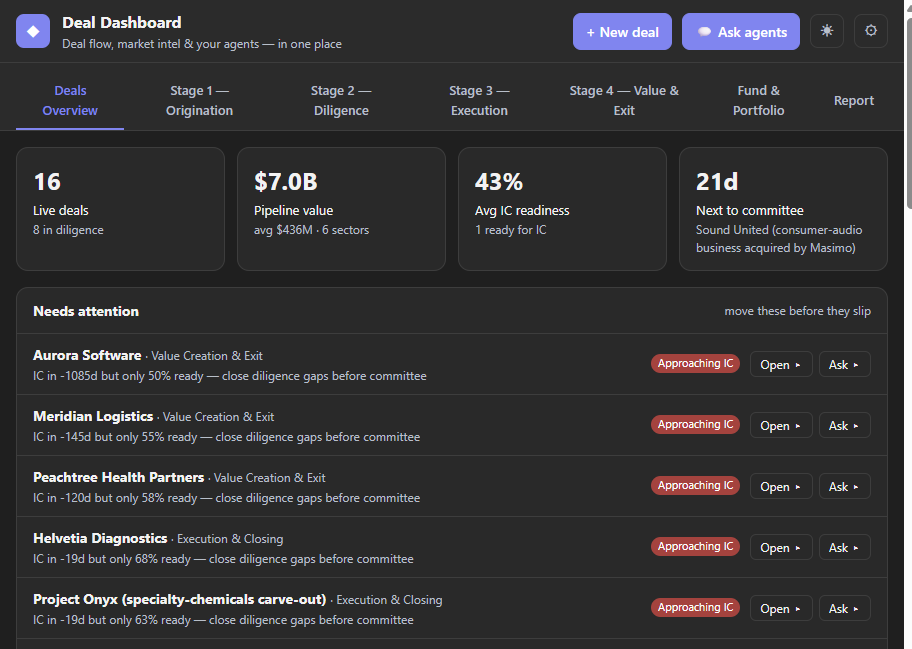
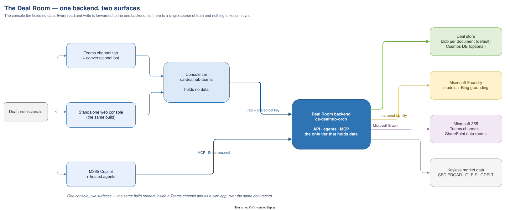
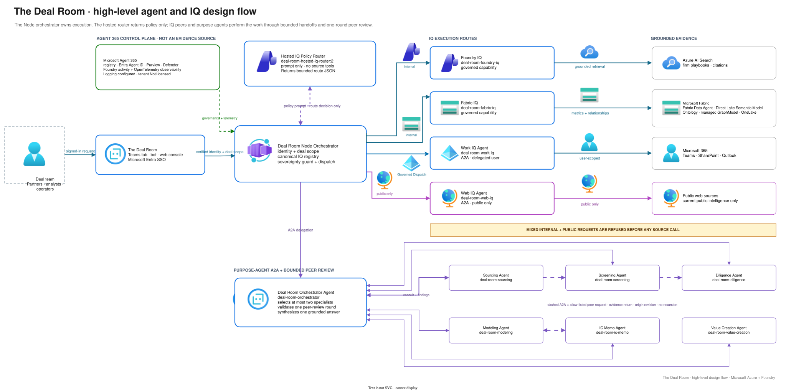
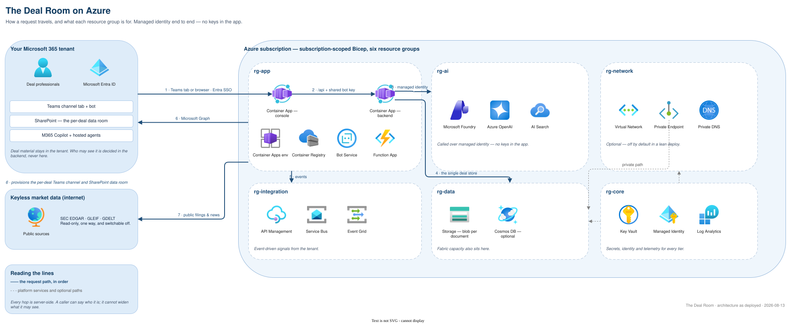

# The Deal Room

> An AI deal team for private markets, built into Microsoft Teams.

The Deal Room carries an investment from sourcing through diligence, Investment Committee,
ownership, and exit. It combines one governed deal record with purpose-built agents, Microsoft
365 context, Fabric business data, firm knowledge, and public research.



## What it does

- Answers deal and portfolio questions from the live, permission-scoped record.
- Routes work to sourcing, screening, diligence, modelling, IC memo, and value-creation agents.
- Shows context, routing choices, specialist handoffs, peer reviews, and IQ tools through a
  toggleable **Agent activity** view in chat.
- Builds IC-ready returns, risks, diligence findings, memos, decks, and approval packs.
- Proposes actions for a person to approve, then records every applied change in the audit trail.
- Connects Microsoft 365, Fabric, firm knowledge, public research, and an existing deal system.
- Enforces deal-by-deal need-to-know, confidential-deal hiding, roles, and data boundaries.

The same experience runs as a Teams channel tab and as a standalone web console.

## How it works



1. A user asks a question in Teams or the web console.
2. The backend resolves identity, role, deal scope, and need-to-know access.
3. The orchestrator chooses a record answer, one agent, or up to two specialists.
4. Agents use only the evidence path allowed for the request.
5. The answer returns with citations, agent activity, and optional user-approved actions.

There is one backend and one deal record. The UI does not keep a second copy of business data.

## Agents and Microsoft IQ



| Capability | Grounding | Role |
|---|---|---|
| **Foundry IQ** | Approved firm knowledge and playbooks | Citation-backed internal guidance |
| **Fabric IQ** | OneLake, semantic model, Ontology, and GraphModel | Governed entities and analytics |
| **Work IQ** | Microsoft 365 files, mail, meetings, and conversations | User-scoped work context |
| **Web IQ** | Public web search | Current external research only |

All four peers are visible Microsoft Foundry agents with native tools. The IQ router can expose
them as bounded A2A tools in the Foundry toolbox. Internal context is never sent to Web IQ, and
mixed private/public requests are refused before a source is called.

## Azure architecture



| Azure service | Purpose |
|---|---|
| **Azure Container Apps** | Runs the backend and Teams/web console |
| **Microsoft Foundry** | Models, prompt agents, A2A orchestration, and Foundry IQ |
| **Microsoft Fabric** | OneLake, semantic model, Ontology, GraphModel, and Fabric IQ |
| **Microsoft Entra ID** | User identity, managed identity, consent, and roles |
| **Azure Storage / Cosmos DB** | Pluggable governed deal persistence |
| **Azure AI Search** | Approved knowledge retrieval for Foundry IQ |
| **Azure Monitor / Application Insights** | Logs, traces, health, and operational evidence |
| **API Management, Service Bus, Event Grid** | Optional enterprise integration and events |

Infrastructure is subscription-agnostic Bicep. Runtime service calls use managed identity rather
than application secrets.

## Run and deploy

```powershell
cd app
npm install
npm test
npm run dev
```

Deploy to Azure with `azd up`. See the [deployment guide](docs/DEPLOY.md) for prerequisites,
tenant consent, configuration, and production validation.

## Documentation

| Read this | For |
|---|---|
| [Architecture](docs/ARCHITECTURE.md) | Product flow, agent orchestration, and Azure services |
| [Demo Center](docs/DEMO-CENTER.md) | Recordings, click-through demos, and presenter runbooks |
| [Inside a deal](docs/DEAL-STAGES.md) | The lifecycle and decision artifacts |
| [Access model](docs/ACCESS-MODEL.md) | Roles, need-to-know, confidential deals, and barriers |
| [Security and compliance](docs/SECURITY-COMPLIANCE.md) | Controls, sovereignty, and responsibility |
| [All documentation](docs/README.md) | Focused guides and deeper engineering references |

[Contributing](CONTRIBUTING.md) · [Security policy](SECURITY.md) · [Agent skills](SKILLS.md)