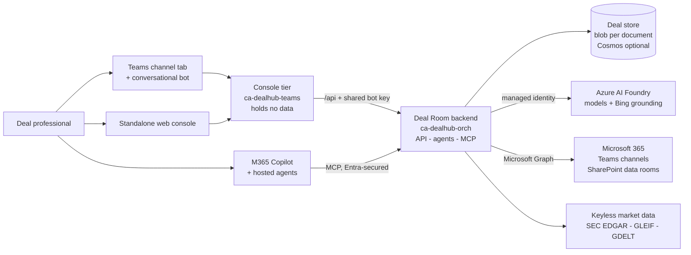
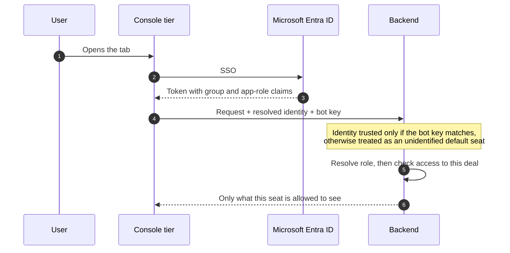
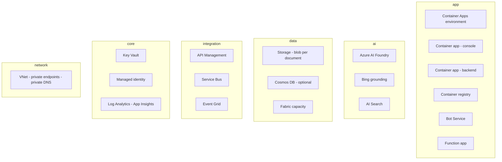

# Architecture

> The one-page picture of [The Deal Room](../README.md). Read this first; everything else in
> `docs/` is a detail of something on this page.
>
> Next: [How it works](HOW-IT-WORKS.md) for the internals · [Access model](ACCESS-MODEL.md) for
> who may see what · [Deploy guide](DEPLOY.md) to run it.

---

## In one paragraph

One backend holds the data and does the thinking. Two surfaces show it: a Teams channel tab
with a conversational bot, and the same build served as a standalone web console. M365 Copilot
and hosted agents reach the same deal tools through an Entra-secured MCP endpoint. Models come
from Azure AI Foundry over managed identity, so there are no keys in the app. The whole thing
is subscription-agnostic Bicep on Azure Container Apps.

---

## The shape of it

**The rule that keeps it honest:** the console tier holds no data. Every read and write is
forwarded to the one backend, so there is a single source of truth and nothing to keep in sync.

---

## Who is allowed to see what

Access is decided on the server. The client can state who it is, but it cannot widen its own
powers — the asserted identity is honoured only when the call carries the shared bot key.

Full behaviour — the two-tier RBAC, deal-team need-to-know, confidential deals and MNPI
barriers — is in the [access model](ACCESS-MODEL.md).

---

## The Azure footprint

Subscription-scoped Bicep, split into six resource groups so each domain can be governed and
costed on its own.

| Resource group | What lives there |
|---|---|
| **app** | The two container apps and their environment, the registry, the bot registration and the Function App. |
| **ai** | Azure AI Foundry models and embeddings, Bing grounding, AI Search. |
| **data** | The deal store — a storage account by default, Cosmos DB when you need it — and Fabric capacity. |
| **integration** | API Management, Service Bus and Event Grid for event-driven signals. |
| **core** | Key Vault, the user-assigned managed identity, Log Analytics and Application Insights. |
| **network** | VNet, private endpoints and private DNS zones. |

---

## What runs where

| Tier | Container app | Role |
|---|---|---|
| **Deal Room (API + data)** | `ca-dealhub-orch-*` — image `deal-room` | The API / data / MCP plane: the pluggable store, the agent engine, the MCP server and Graph provisioning. **The only tier that holds data.** |
| **Deal Room console** | `ca-dealhub-teams-*` — image `deal-room-teams` | The user-facing console — Teams tab, bot, and the same build as a standalone web app. Forwards everything to the backend. |

---

## Two choices worth knowing early

- **The database is optional.** `DEALROOM_STORE=blob` is the default and writes one JSON blob
  per document to the storage account that already exists, so a full demo provisions no
  database and carries no standing database cost. Switch to `cosmos` for production
  concurrency. See [persistence](HOW-IT-WORKS.md#persistence--cosmos-is-optional).
- **It can be switched off.** The platform sleeps and wakes as one unit, and an idle demo can
  cost nothing. See [cost control](HOW-IT-WORKS.md#cost-control--sleep--wake-the-platform) and
  the [operations plan](operations/OPERATIONS-PLAN.md).

---

## The editable diagram

The detailed Azure drawing, with official Azure icons and numbered flows, is kept as an
editable source rather than a picture:

> 📐 **[Open the interactive architecture diagram →](https://viewer.diagrams.net/?tags=%7B%7D&lightbox=1&nav=1&title=architecture#Uhttps%3A%2F%2Fraw.githubusercontent.com%2Famitdesai08%2Fprivate-markets-deal-room%2Fmain%2Fdocs%2Freference%2Farchitecture.drawio)**
>
> To edit, open [`docs/reference/architecture.drawio`](reference/architecture.drawio) in VS Code
> with the **Draw.io Integration** extension — the icons are embedded, so the file is
> self-contained.

---

## Where to go next

| If you want to | Read |
|---|---|
| Understand the internals | [How it works](HOW-IT-WORKS.md) |
| Know who can see what | [Access model](ACCESS-MODEL.md) |
| Deploy it | [Deploy guide](DEPLOY.md) |
| Connect real market data | [Data integration](integration/DATA-INTEGRATION.md) |
| Answer a security review | [Security appendix](security/buyer-security-compliance.md) |
