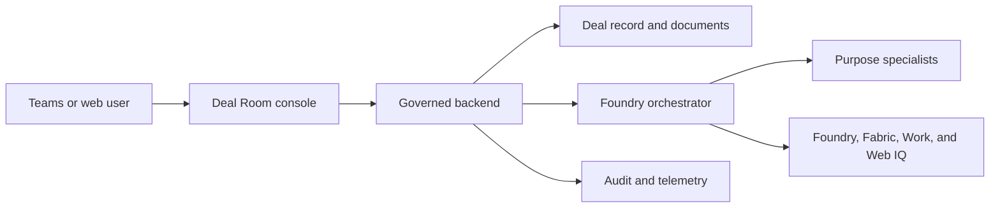

# Architecture

The Deal Room is one governed backend presented through Microsoft Teams and a standalone web
console. Microsoft Foundry agents use the same permission-scoped deal tools, so chat, dashboards,
documents, and automations work from one record.

## High-level overview

The console holds no business data. Every request crosses the server-side identity and access
boundary before the backend reads a deal, invokes an agent, or applies an approved action.

```mermaid
flowchart LR
    U[Teams or web user] --> UI[Deal Room console]
    UI --> API[Governed backend]
    API --> DATA[Deal record and documents]
    API --> ORCH[Foundry orchestrator]
    ORCH --> AGENTS[Purpose specialists]
    ORCH --> IQ[Foundry, Fabric, Work, and Web IQ]
    API --> AUDIT[Audit and telemetry]
```

## Agent and IQ flow

The policy router classifies the permitted evidence path without reading source data. The backend
then applies caller identity, effective role, deal scope, and need-to-know access before choosing a
record answer, a single agent, or bounded specialist collaboration.

The reusable `deal-room-iq` Foundry toolbox exposes Microsoft's four IQ capabilities directly:
Work IQ over Microsoft-hosted A2A, Fabric IQ over the governed ontology, Foundry IQ through the
approved knowledge-base MCP endpoint, and Web IQ through native Foundry web search. Deal Room
prompt agents wrap those capabilities only when bounded instructions or A2A collaboration are needed.

The chat's optional **Agent activity** view exposes:

- context provided for the turn and scope inferred by policy;
- the orchestrator's route and fan-out choice with a concise rationale;
- specialist handoffs, bounded peer-review choices, and synthesis;
- actual record or IQ tool calls reported by the completed response.

It is an operational trace, not private model reasoning. Route classification is shown separately
from confirmed tool invocation, so the interface does not claim an IQ system was used when it was
only selected as the allowed evidence path.

## Azure services

| Service | Responsibility |
|---|---|
| **Azure Container Apps** | Backend API/MCP plane and the Teams/web console |
| **Microsoft Foundry** | Model inference, visible agents, A2A tools, and orchestration |
| **Microsoft Fabric** | OneLake, semantic model, Ontology, GraphModel, and data agent |
| **Microsoft Entra ID** | SSO, managed identity, delegated consent, and access groups |
| **Azure Storage / Cosmos DB** | Deal, document, and audit persistence |
| **Azure AI Search** | Foundry IQ knowledge retrieval |
| **Azure Monitor / Application Insights** | Health, logs, traces, and usage evidence |
| **API Management / Service Bus / Event Grid** | Optional governed integrations and events |

The deployment is defined in Bicep. Managed identities authorize service-to-service calls;
optional private endpoints keep the data plane on the virtual network.

## Trust boundaries

- The server, not the browser, decides role and deal access.
- Hosted specialists receive only caller-authorized context.
- Work IQ remains user-scoped; Fabric and Foundry IQ remain internal-data paths.
- Web IQ receives public-only prompts and cannot receive private deal or Microsoft 365 content.
- Agent writes remain proposals until an authorized person approves them.
- Every accepted write is attributed in the audit trail.

For detail, read the [access model](ACCESS-MODEL.md), [security controls](SECURITY-COMPLIANCE.md),
[agent and IQ reference](diagrams/agent-iq-a2a.md), or [deployment guide](DEPLOY.md).