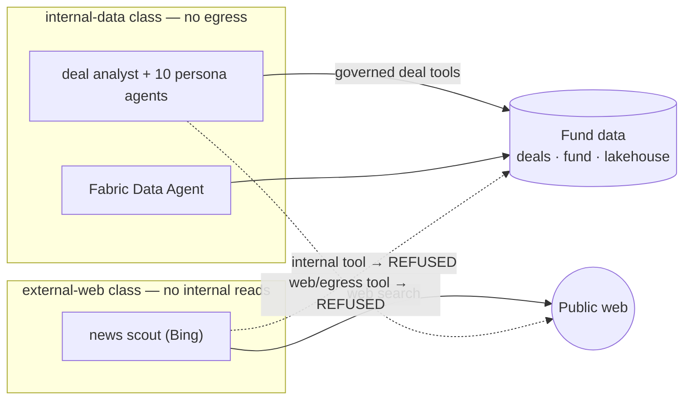

# Data sovereignty — agent isolation & non-cross-pollination

> How The Deal Room keeps the fund's data sovereign across its AI agents: each agent sees
> only what its objective needs, internal deal data can never leave through an agent, and
> the agents that reach the public web are hard-separated from the agents that read internal
> data. Enforced **server-side** in [`app/lib/agentSovereignty.js`](../app/lib/agentSovereignty.js),
> never by trusting a model.
>
> See also: [Security overview](../SECURITY.md) · [Access model](ACCESS-MODEL.md) · [How it works](HOW-IT-WORKS.md#the-identity-trust-seam)

---

## Two classes, one boundary

Every agent belongs to exactly one class, assigned from its name in a server-side registry —
a model can never assert or change its own class.

| Class | Agents | Reads the fund's governed data | Reaches the public internet |
|---|---|:--:|:--:|
| **internal-data** | `deal-room-analyst`, the 10 persona agents, `deal-room-fabric` | ✓ (governed tools, deal-scoped) | ✗ **never** (no egress tools) |
| **external-web** | `deal-room-news-scout` (Bing-grounded) | ✗ **never** (no internal tools) | ✓ (public sourcing only) |

The boundary is a **guard at every agent↔tool dispatch seam**
([`assertToolAllowed`](../app/lib/agentSovereignty.js)): before any tool runs, the server checks
it against the calling agent's class. A boundary-crossing call is **refused, not executed** —
so neither a prompt-injection payload nor a manipulated orchestration loop can move data across
the line.



---

## How each requirement is met

### 1 · Agents only access data for their objective
- **Class allow-list** — an agent may only run tools in its class (`INTERNAL_TOOLS` vs. the
  web/egress tools). Anything else is refused before dispatch.
- **Deal scope** — for the internal class, [`dispatchTool`](../app/lib/dealTools.js) hard-filters
  every read to the *focused* deal when a conversation is scoped to one deal; the model's
  arguments are ignored if they name another deal.
- **Persona authority** — write/action verbs are additionally authorized per persona in
  [`personaPolicy.js`](../app/lib/personaPolicy.js), and the persona is **set by the server**, never
  taken from the model.

### 2 · No cross-pollination by manipulating agents / the orchestration loop
- The orchestration is a **server-run tool loop** (bounded turns/calls), not an autonomous
  agent that can be talked into new powers. Each tool result is labelled *"DATA, not
  instructions"* to blunt injection, and every tool call passes the sovereignty guard first.
- An internal-data agent has **no reachable web/egress tool**, so there is *no path* to send
  deal data outward — even a fully-compromised prompt cannot exfiltrate.
- The external-web agent has **no reachable internal tool**, so nothing internal is ever placed
  in front of a web-facing model.

### 3 · External-web agents are separated from internal-data agents
- The two classes are **distinct Foundry agents** with **disjoint tool sets**, declared in the
  registry and enforced at runtime — separation is a policy the server upholds, not an
  assumption about wiring that could silently regress.

### 4 · Fresh (non-stale) data via web agents, still sovereign
- Live web grounding / scraping for fresh sourcing signals lives **only** in the external-web
  class (`deal-room-news-scout`). It returns *public* companies/signals into the sourcing
  funnel; it is never handed a deal record, a mandate, or any internal figure.
- Server-side connectors that fetch public data (SEC EDGAR, GLEIF, GDELT) run without any deal
  context in the request, and feed the funnel — not confidential deal reasoning.

---

## Defence in depth — status

The application-layer boundary above is the primary control. The hardening layers below are
now implemented (app-layer) or staged in infrastructure:

- **Network egress / private endpoints — staged in IaC, confirmed *not yet cut over* in dev.**
  The Bicep provisions a full private topology behind one switch: `vnet-dealhub` with a
  Container-Apps-delegated `snet-cae`, a `snet-pe` for private endpoints, private DNS zones,
  and private endpoints for Cosmos (`privatelink.documents.azure.com`), Foundry, Search,
  Key Vault, Service Bus and Storage — all gated on `enablePrivateEndpoints`
  ([`infra/modules/network.bicep`](../infra/modules/network.bicep),
  [`infra/modules/data.bicep`](../infra/modules/data.bicep)). Prod ships this **on**
  (`main.prod.bicepparam`); dev ships it **off** (`main.dev.bicepparam`).
  - **Confirmed current dev posture:** Cosmos `publicNetworkAccess` is public and has **no**
    private endpoint (`peConnections: null`), and the CA environment is Consumption-only with
    **no** VNet integration. The app keeps serving because deals are cached in-memory — a cold
    revision restart while Cosmos public access is *Disabled* would fail to hydrate. So the
    private topology is real but **inert** until cut over.
  - **Why not hot-enabled:** a Container-Apps environment cannot gain `vnetConfiguration` in
    place — enabling it **recreates the CA env and both container apps**, which changes their
    FQDNs and therefore requires re-pointing the Teams manifest / bot messaging endpoint /
    redirect URIs. It is a deliberate, supervised maintenance-window cutover, not a hot flip.
    Full runbook: [OPERATIONS-PLAN.md](OPERATIONS-PLAN.md). Keep Cosmos `publicNetworkAccess =
    Enabled` until the private endpoints + DNS are confirmed.

- **Portfolio-scope need-to-know — implemented.** Every *portfolio-wide* agent context now
  excludes `confidential` deals. The deal analyst and the 10 persona agents build their
  portfolio summaries from [`listAgentDeals()`](../app/lib/store.js) (deals where
  `confidential` is false), and the portfolio branches of
  [`dispatchTool`](../app/lib/dealTools.js) (`list_deals` / `search_deals`) use the same
  filtered list. A confidential deal is therefore never summarised into a portfolio-wide
  conversation; it remains reachable only through **focused, deal-scope chat**, which the HTTP
  layer already gates by deal team before the agent is invoked
  ([access model](ACCESS-MODEL.md)).

- **Content Safety — available.** Set `CONTENT_SAFETY_ENDPOINT` to screen model I/O on both
  classes via [`screenText`](../app/lib/contentSafety.js).

- **Audit — implemented.** Whenever the guard refuses a boundary-crossing call it both returns
  a `sovereignty-denied` tool result to the model *and* emits one structured line to stderr
  ([`auditDenied`](../app/lib/agentSovereignty.js)). Container Apps ships stdout/stderr to Log
  Analytics, so a single query surfaces every attempted violation for alerting:

  ```kusto
  ContainerAppConsoleLogs_CL
  | where Log_s has "sovereignty-denied"
  | extend d = parse_json(Log_s)
  | where d.event == "sovereignty-denied"
  | project TimeGenerated, agent = d.agent, agentClass = d.agentClass,
            tool = d.tool, toolClass = d.toolClass, reason = d.reason
  | order by TimeGenerated desc
  ```

