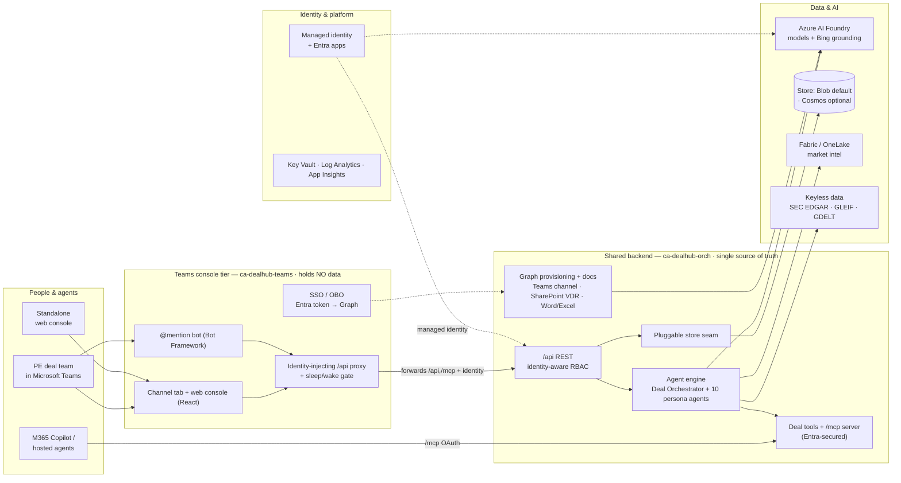

# How it works — architecture & internals

> The technical "how" behind [The Deal Room](../README.md): one shared backend, two
> surfaces, Azure AI Foundry agents, a pluggable store, and identity-aware access — all
> subscription-agnostic Bicep on Azure Container Apps.
>
> See also: [Deploy guide](DEPLOY.md) · [Access model](ACCESS-MODEL.md) · [Inside a deal](DEAL-STAGES.md)

---

## Architecture at a glance



> 🖉 **Editable source:** the diagram above is kept current here; the drawio source
> ([`docs/architecture.drawio`](architecture.drawio)) is the detailed infra view.

---

## One backend, two surfaces

A single application and a single source of truth, presented through two container apps
that run side by side:

| Tier | Container app | Role |
|---|---|---|
| **Deal Room (API + data)** | `ca-dealhub-orch-*` (image `deal-room`) | The API / data / MCP plane — the pluggable store (**blob-per-document by default**, Cosmos DB optional), the agent engine, the MCP server, and Microsoft Graph provisioning. **The only tier that holds data.** |
| **Deal Room console (Teams + web)** | `ca-dealhub-teams-*` (image `deal-room-teams`) | The user-facing console — the Teams channel tab + conversational bot, and the *same* console served as a **standalone web app**. Holds **no data**; every read/write forwards to the orchestrator over `/api`. |

> **One console, two surfaces — not a duplicated app.** The console tier proxies all data
> to the one backend (`SHARED_BACKEND_URL`), so there's a single data source and nothing to
> keep in sync. The *same* build renders natively inside a Teams channel and as a standalone
> web app over the *same* deal record.

**Teams platform capabilities used** — Entra **SSO** (per-user tab context) · **Bot
Framework** conversational bot (single-tenant) · **channel tabs** · **Adaptive Cards**
proactive alerts · **deep links** back to the tab · **org app catalog** distribution ·
per-deal **Teams channels** + **SharePoint** data rooms · an **MCP** endpoint that lets
**M365 Copilot** and hosted agents call the same grounded deal tools.

---

## The identity trust seam

Access is resolved **server-side** so a client can never widen its own powers:

- The Teams tier authenticates the user (Entra SSO, or a demo profile) and forwards the
  **resolved identity** to the orchestrator, trusted only when it carries the shared bot key.
- The orchestrator's `requestingIdentity` honours that identity (from the request body or a
  trusted `x-dr-user` header) **only** when the bot key matches — otherwise the caller is
  treated as an unidentified default role.
- Every deal read/list/action then resolves through the two-tier access model.

See the [Access model](ACCESS-MODEL.md) for the full RBAC, need-to-know and confidential-deal
behaviour.

---

## AI & agents

- **Azure AI Foundry** provides the models (`gpt-5-mini` / `nano` + embeddings) and **Bing
  grounding**, called via **managed identity** — no keys in the app.
- The agent layer is a **Deal Orchestrator**, a **News Scout**, and **10 role-governed
  persona agents** (analyst, partner, principal, 3 sector MDs, operating partner, fund CFO,
  GC, investor relations).
- The **Deal MCP server** (`/mcp`, Entra-secured) exposes the read-only research surface
  (`list_deals`, `get_deal`, `get_returns`, `get_value_creation`, …) as reusable tools — the
  same tools power **M365 Copilot** and any hosted / Copilot Studio agent you point at it.

---

## Persistence — Cosmos is optional

The app persists through a single seam ([`app/lib/repo`](../app/lib/repo)) with a pluggable
`DEALROOM_STORE` driver:

| Driver | Backend | When |
|---|---|---|
| **`blob`** *(default on `azd`)* | one JSON blob per document on the existing data storage account — no new resource, no Cosmos | demos / PoCs / lean deploys |
| `cosmos` | Azure Cosmos DB for NoSQL (serverless) | production / high-concurrency |
| `memory` | in-process | local dev |

With `storeDriver=blob` the Bicep **does not provision Cosmos at all**. Switch to `cosmos`
only when you need it.

---

## Free, keyless market data

For demos without a paid provider, the platform supplements the seeded record with **real,
keyless** data: **SEC EDGAR / XBRL** fundamentals (a Morningstar-quality substitute), **GLEIF**
entity & ownership, and **GDELT** news. See `/api/providers/keyless`.

---

## Cost control — sleep & wake the platform

An idle demo shouldn't cost anything. Power the platform off/on as one unit:

- **Whole-platform switch** — [`scripts/platform-power.ps1`](../scripts/platform-power.ps1) /
  [`.sh`](../scripts/platform-power.sh) with `stop`, `start`, `sleep` (orchestrator off, Teams
  gate stays up) or `status`. `stop`/`start` also stop/start the **Function App** and
  **suspend/resume Fabric capacity**, and print a **standing-cost report** for resources that
  keep billing (AI Search, APIM, ACR, Log Analytics, App Insights, Cosmos). Use `-ComputeOnly`
  for just the container apps.
- **Self-service in Teams** — when the orchestrator is asleep, the tab shows an **offline
  gate**: anyone can **bring it online for 1 hour** (auto-stops after), while **keeping it
  online indefinitely is admin-only** (gated by `ADMIN_IDS`, enforced server-side).
- **How it's wired** — the Teams app's managed identity may start/stop only the orchestrator
  (`raOrchPowerControl` in [`infra/modules/app.bicep`](../infra/modules/app.bicep)); set
  `PLATFORM_LEASE_HOURS` for the lease and `PLATFORM_CONTROL=false` to disable.

---

## Repository layout

```
.
├── app/                    The API / data / MCP service (Node/Express) — no web client
│   ├── lib/                AI client, agents, pluggable store, MCP server, Graph, fund/portfolio engine
│   ├── data/               Lifecycle & flow, personas, deals, sourcing framework, owned portfolio
│   ├── scripts/            Foundry agent provisioning (create_agent.py template + persona agents)
│   ├── mcp/                Deal MCP server OpenAPI + Copilot Studio guide
│   └── Dockerfile          Multi-stage build (deps → runtime)
├── teams-app/              The Teams interface tier (thin front end; holds no data)
│   ├── tab/                Teams-native + standalone web console (React + Vite)
│   ├── server/             SSO/OBO, bot (Bot Framework), backend proxy, Adaptive Cards
│   ├── manifest/           Teams app manifest + build script
│   └── Dockerfile          Multi-stage build (tab → server → runtime)
├── infra/                  Azure IaC — subscription-scoped, domain-split into 6 resource groups
│   ├── main.bicep          Orchestrator + modules/ (core · ai · data · app · integration · network)
│   └── main.{dev,test,prod,sample}.bicepparam
├── docs/                   Architecture, how-it-works, deploy, access model, stages, demos
├── scripts/                Deploy + Entra-provisioning + azd hooks
└── .github/workflows/      OIDC CI/CD for infra and app
```

---

## Run locally

```powershell
cd app
npm install
$env:PORT = 8080
node server.js                  # http://localhost:8080/api  (demo mode without a Foundry endpoint)
```

The API runs in **demo mode** out of the box (seeded AI responses). The user console lives in
`teams-app/` (build the tab with `npm run build:tab`; it runs in Teams and as a standalone web
console). Set `AZURE_OPENAI_ENDPOINT` / `AZURE_OPENAI_DEPLOYMENT` to point at a deployed
Foundry model for live inference.

> Ready to ship it? See the [**Deploy guide**](DEPLOY.md).
